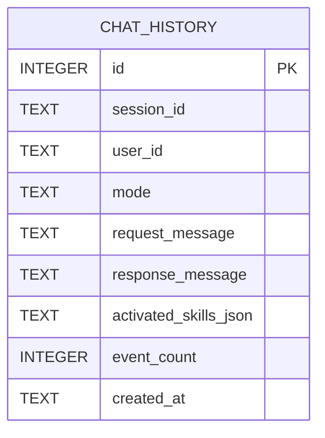

# Persistence ER Diagram

Notes:
- `activated_skills_json` stores activated skill names as JSON array string for cross-RDB compatibility.
- Index `idx_chat_history_session_created` supports session history retrieval.
