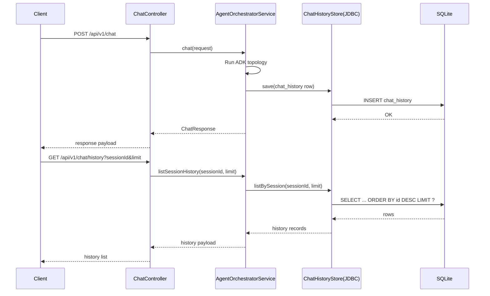

# Persistence Data Flow

```mermaid
sequenceDiagram
    participant Client
    participant Controller as ChatController
    participant Service as AgentOrchestratorService
    participant Store as ChatHistoryStore(JDBC)
    participant DB as SQLite

    Client->>Controller: POST /api/v1/chat
    Controller->>Service: chat(request)
    Service->>Service: Run ADK topology
    Service->>Store: save(chat_history row)
    Store->>DB: INSERT chat_history
    DB-->>Store: OK
    Service-->>Controller: ChatResponse
    Controller-->>Client: response payload

    Client->>Controller: GET /api/v1/chat/history?sessionId&limit
    Controller->>Service: listSessionHistory(sessionId, limit)
    Service->>Store: listBySession(sessionId, limit)
    Store->>DB: SELECT ... ORDER BY id DESC LIMIT ?
    DB-->>Store: rows
    Store-->>Service: history records
    Service-->>Controller: history payload
    Controller-->>Client: history list
```
